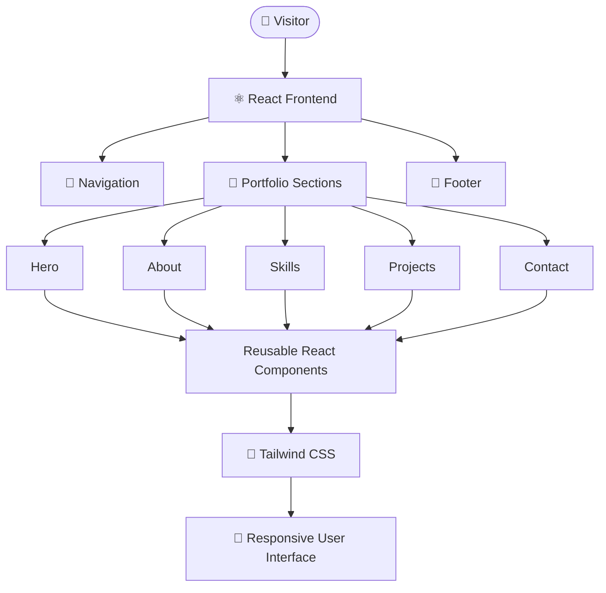

<div align="center">
      
# 🌐 Personal Portfolio Website
**A modern, responsive, and interactive developer portfolio built with React, TypeScript, Tailwind CSS, and Vite** — showcasing technical skills, projects, experience, achievements, and professional growth.

<p> 
  
  
  
  
</p>

<p>
  
  
  
</p>

**[🔗 Live Demo](https://your-portfolio-url.com)** · **[🐛 Report Bug](../../issues)** · **[💡 Request Feature](../../issues)**

</div>

---

<div align="center">

[Overview](#-overview) •
[Features](#-features) •
[Sections](#-portfolio-sections) •
[Tech Stack](#️-tech-stack) •
[Architecture](#️-architecture) •
[Structure](#-project-structure) •
[Getting Started](#️-getting-started) •
[Customization](#-customization) •
[Deployment](#-deployment) •
[Roadmap](#️-roadmap)

</div>

---

## 📌 Overview

This project is a personal developer portfolio website designed to provide a centralized and professional representation of my technical background, development journey, and selected work.

The portfolio brings together:

| | |
|---|---|
| 👨‍💻 Technical skills and expertise | 🏆 Achievements and certifications |
| 🚀 Software, web, and AI/ML projects | 🤝 Services and development capabilities |
| 💼 Professional experience | 📬 Contact and networking information |
| 🎓 Educational background | 🔗 GitHub and social profiles |

The application is built using a **component-driven React architecture**, allowing individual sections to remain modular, reusable, maintainable, and easy to extend.

### 🎯 Project Objectives

| Objective | Implementation |
|:---|:---|
| 🎨 **Modern UI** | Clean, professional developer-focused interface |
| 📱 **Responsive Design** | Layouts designed for desktop, tablet, and mobile |
| ⚡ **Fast Development** | Vite-based development and build workflow |
| 🧩 **Maintainability** | Reusable React components |
| 📘 **Type Safety** | TypeScript-based development |
| 🎨 **Consistent Styling** | Tailwind CSS utility-based styling |
| ♿ **Accessibility** | Semantic HTML and accessible interaction patterns |
| 🚀 **Extensibility** | Modular structure for future features |

---

## ✨ Features

### 🎯 Core Features

- 📱 **Responsive Design** — adapts to desktop, tablet, and mobile screen sizes
- ⚛️ **Component-Based UI** — portfolio sections organized into reusable React components
- 🎨 **Modern Interface** — clean and professional visual design
- 🧭 **Section Navigation** — smooth navigation between portfolio sections
- ⚡ **Vite Workflow** — fast dev server with HMR and optimized production builds
- 🎨 **Tailwind CSS** — utility-first responsive styling
- 📘 **TypeScript** — strong typing and improved maintainability
- 🧹 **ESLint** — consistent code quality and development standards
- 📂 **Modular Structure** — organized codebase designed for future expansion

---

## 📄 Portfolio Sections

<details open>
<summary><strong>👋 Hero</strong></summary>

The primary introduction section that establishes professional identity and provides quick access to important actions.

- Developer introduction and professional headline
- Short personal tagline
- Primary call-to-action
- Professional / social profile links

</details>

<details>
<summary><strong>👨‍💻 About</strong></summary>

An overview of academic background, interests, development journey, and career objectives.

</details>

<details>
<summary><strong>🛠️ Skills</strong></summary>

Technical capabilities across relevant development areas:

| Category | Focus |
|:---|:---|
| Programming Languages | Core language proficiency |
| Frontend Development | UI frameworks and libraries |
| Backend Development | Server-side development |
| Databases | Relational and NoSQL systems |
| AI / Machine Learning | Models, libraries, and tooling |
| Cloud & DevOps | Deployment and infrastructure |
| Developer Tools | Version control, editors, utilities |

</details>

<details>
<summary><strong>🚀 Projects</strong></summary>

Selected projects with a focus on practical implementation and technical capability. Each project entry may include:

- Project description and the problem it solves
- Key features and technologies used
- GitHub repository and live demo links
- Project outcomes

</details>

<details>
<summary><strong>💼 Services</strong></summary>

Development capabilities and areas where technical expertise can be applied — web development, frontend, backend, REST API development, UI implementation, AI/ML solutions, and general software development.

</details>

<details>
<summary><strong>📈 Experience</strong></summary>

Professional and technical growth through internships, projects, hackathons, certifications, achievements, and leadership experiences.

</details>

<details>
<summary><strong>🏆 Achievements</strong></summary>

Notable accomplishments, certifications, competitions, and professional milestones.

</details>

<details>
<summary><strong>📬 Contact</strong></summary>

A straightforward way for visitors to connect regarding job opportunities, internships, freelance work, collaboration, technical discussions, or professional networking.

</details>

<details>
<summary><strong>🔗 Footer</strong></summary>

Supporting navigation and professional information — quick links, social profiles, contact details, copyright, and additional resources.

</details>

---

## 🖥️ Tech Stack

| Technology | Role |
|:---|:---|
| ⚛️ **React** | Building reusable and interactive UI components |
| 📘 **TypeScript** | Type-safe application development |
| 🎨 **Tailwind CSS** | Responsive, utility-first styling |
| ⚡ **Vite** | Development server and production build tooling |
| 📦 **npm** | Dependency and package management |
| 🧹 **ESLint** | Code quality and consistency |

---

## 🏗️ Architecture

The application follows a **component-driven frontend architecture**.



### Architectural Principles

| Principle | Description |
|:---|:---|
| **Component separation** | Each major section has a dedicated component |
| **Reusability** | Common UI patterns are shared across sections |
| **Separation of concerns** | Structure, styling, and logic stay organized |
| **Type safety** | TypeScript provides compile-time checking |
| **Maintainability** | Clear folder organization eases future changes |
| **Scalability** | New sections can be added without restructuring |

---

## 📂 Project Structure

```text
portfolio/
│
├── public/                     # Static assets served as-is
│
├── src/
│   ├── assets/                 # Images, icons, and local media
│   │
│   ├── components/             # Reusable UI + section components
│   │   ├── Navbar.tsx
│   │   ├── HeroSection.tsx
│   │   ├── AboutSection.tsx
│   │   ├── SkillsSection.tsx
│   │   ├── ProjectsSection.tsx
│   │   ├── ServicesSection.tsx
│   │   ├── ExperienceSection.tsx
│   │   ├── ContactSection.tsx
│   │   └── Footer.tsx
│   │
│   ├── pages/
│   │   └── Index.tsx           # Composes all sections into one page
│   │
│   ├── App.tsx                 # Root application component
│   ├── main.tsx                # Application entry point
│   └── index.css               # Global styles + Tailwind directives
│
├── package.json
├── tsconfig.json
├── vite.config.ts
├── eslint.config.js
└── README.md
```

> [!NOTE]
> The structure above reflects the intended React + TypeScript organization. If the actual repository differs, update this section to match the implementation.

---

## ⚙️ Getting Started

### Prerequisites

| Requirement | Recommended | Purpose |
|:---|:---|:---|
| **Node.js** | LTS (18+) | JavaScript runtime |
| **npm** | Bundled with Node | Package management |
| **Git** | Any recent version | Cloning the repository |

Verify your installations:

```bash
node --version
npm --version
git --version
```

### 🚀 Quick Start

```bash
# 1. Clone the repository
git clone <repository-url>

# 2. Navigate to the project
cd portfolio

# 3. Install dependencies
npm install

# 4. Start the development server
npm run dev
```

Vite will start the local dev server and print the URL in your terminal (typically `http://localhost:5173`). Open it in a browser to view the portfolio.

### 📜 Available Scripts

| Command | Description |
|:---|:---|
| `npm run dev` | Start the development server with hot module replacement |
| `npm run build` | Create an optimized production build in `dist/` |
| `npm run preview` | Serve the production build locally for verification |
| `npm run lint` | Run ESLint across the codebase |

### 🏭 Production Build

```bash
npm run build     # Outputs to dist/
npm run preview   # Preview the build before deploying
```

### 🧹 Code Quality

```bash
npm run lint
```

ESLint helps identify potential problems and maintain consistent coding practices throughout the project.

---

## 🔧 Customization

Adapting this portfolio for your own use is mostly a matter of editing content inside the section components:

| What to change | Where to look |
|:---|:---|
| Name, headline, tagline | `src/components/HeroSection.tsx` |
| Bio and background | `src/components/AboutSection.tsx` |
| Skills and categories | `src/components/SkillsSection.tsx` |
| Project cards and links | `src/components/ProjectsSection.tsx` |
| Experience timeline | `src/components/ExperienceSection.tsx` |
| Email and social links | `src/components/ContactSection.tsx`, `Footer.tsx` |
| Colors, fonts, spacing | `tailwind.config.js`, `src/index.css` |
| Images and resume file | `src/assets/`, `public/` |
| Page title, favicon, meta tags | `index.html` |

> [!TIP]
> For easier maintenance, consider moving project, skill, and experience content into typed data files (e.g. `src/data/projects.ts`) so the components stay purely presentational.

---

## 🎨 Design Philosophy

| Principle | Approach |
|:---|:---|
| 🧘 **Minimalism** | Keep the interface focused on meaningful content, avoiding visual noise |
| 📱 **Responsiveness** | Deliver a consistent experience across screen sizes and devices |
| ♿ **Accessibility** | Semantic HTML, readable typography, and accessible interactive elements |
| ⚡ **Performance** | Efficient frontend practices to keep the app lightweight |
| 🧩 **Modularity** | Independent components that can be maintained individually |
| 🎯 **User Experience** | Important information is easy to discover; navigation stays intuitive |

### 📊 Quality Goals

- ⚡ Fast loading and responsive interactions
- 📱 Mobile-first compatibility
- 🧩 Reusable UI components
- 📘 Strong TypeScript usage
- 🧹 Maintainable source code
- ♿ Accessible interfaces
- 🔍 Search-engine-friendly structure
- 📦 Efficient asset usage
- 🚀 Reliable production builds
- 🔐 Secure deployment practices

> [!IMPORTANT]
> These are project goals rather than guarantees of a specific performance or accessibility score.

---

## 🌐 Deployment

The production build generated by Vite can be deployed to any modern static hosting platform.

```bash
npm run build     # Generates the dist/ directory
```

Then deploy `dist/` using your hosting provider's recommended process.

| Platform | Notes |
|:---|:---|
| **Vercel** | Import the repo; framework preset **Vite**, output directory `dist` |
| **Netlify** | Build command `npm run build`, publish directory `dist` |
| **GitHub Pages** | Set `base: '/<repo-name>/'` in `vite.config.ts` before building |
| **Cloudflare Pages** | Build command `npm run build`, output directory `dist` |
| **Any static host** | Upload the contents of `dist/` |

> [!WARNING]
> Single-page routing requires a rewrite rule (all routes → `index.html`) on most hosts. Without it, deep links will return 404s.

---

## 🗺️ Roadmap

### 🎨 UI / UX

- [ ] 🌙 Dark / light theme toggle
- [ ] ✨ Advanced animations and micro-interactions
- [ ] 🎭 Enhanced page transitions
- [ ] 📱 Additional mobile UX improvements

### 🚀 Functionality

- [ ] 🔎 Project filtering by technology
- [ ] 📝 Personal blog
- [ ] 📄 Downloadable resume
- [ ] 📬 Functional contact form
- [ ] 📧 Email notification integration
- [ ] 🤖 AI-powered portfolio assistant

### 📈 Performance & Deployment

- [ ] 🔍 Advanced SEO optimization
- [ ] 📊 Analytics integration
- [ ] ♿ Additional accessibility improvements
- [ ] 🌐 Custom domain
- [ ] 📈 Performance monitoring
- [ ] 🔐 Additional production security hardening

---

## 🔐 Development Best Practices

The project follows modern frontend development practices:

♻️ Component reusability · 📘 Type-safe development · 🧱 Separation of concerns · 🌐 Semantic HTML · 📱 Responsive layouts · 🧹 Consistent naming conventions · 📂 Organized source structure · 🎨 Maintainable styling · 🔧 Environment-based configuration · 🚀 Production-oriented builds

---

## 🤝 Contributing

Contributions, suggestions, and improvements are welcome.

```bash
# 1. Create a feature branch
git checkout -b feature/new-feature

# 2. Stage your changes
git add .

# 3. Commit using conventional commit style
git commit -m "feat: add new portfolio feature"

# 4. Push the branch
git push origin feature/new-feature
```

Then open a Pull Request with a clear description of the changes.

**Commit convention:** `feat:` new feature · `fix:` bug fix · `docs:` documentation · `style:` formatting · `refactor:` restructuring · `chore:` tooling and maintenance

---

## ❓ FAQ

<details>
<summary><strong>Can I use this portfolio as a template for my own?</strong></summary>

Yes — it's intended for personal and educational use. See the [Customization](#-customization) section for where to swap in your own content, and please keep attribution if you reuse significant portions of the design or code.

</details>

<details>
<summary><strong>The dev server won't start — what should I check?</strong></summary>

Confirm Node.js is on an LTS version (18+), delete `node_modules` and `package-lock.json`, then run `npm install` again. If port 5173 is occupied, Vite will offer an alternative port.

</details>

<details>
<summary><strong>Tailwind classes aren't applying. Why?</strong></summary>

Check that your file paths are included in the `content` array of `tailwind.config.js`, and that the Tailwind directives are present in `src/index.css`.

</details>

<details>
<summary><strong>My deployed site shows a blank page.</strong></summary>

This is usually a base path issue. On GitHub Pages, set `base: '/<repo-name>/'` in `vite.config.ts` and rebuild.

</details>

---

## 📌 Project Status

**Status:** 🟢 Actively Maintained

The portfolio evolves continuously as new projects are completed, technologies are learned, achievements are earned, experiences are gained, and UI/UX and performance improvements are introduced.

---

## 👨‍💻 About the Developer

**Mohit Raikwar** is a Computer Science & Engineering student interested in building practical software and exploring modern technologies.

**Areas of interest:** 🤖 Artificial Intelligence & Machine Learning · 💻 Software Development · 🌐 Web Development · ⚙️ Backend & Distributed Systems · ☁️ Cloud & DevOps · 📊 Data Science · 🚀 Scalable Applications

This portfolio represents an ongoing journey of learning, building, experimenting, and growing as a developer.

---

## 📄 License

This project is intended primarily for **personal and educational use**.

If significant portions of the design or source code are reused, appropriate attribution is appreciated.

---

<div align="center">

### 🚀 Built With

**React • TypeScript • Tailwind CSS • Vite**

**Designed to showcase skills. Built to create opportunities. 🚀**

⭐ *If you find this project useful, consider giving the repository a star!*

</div>
